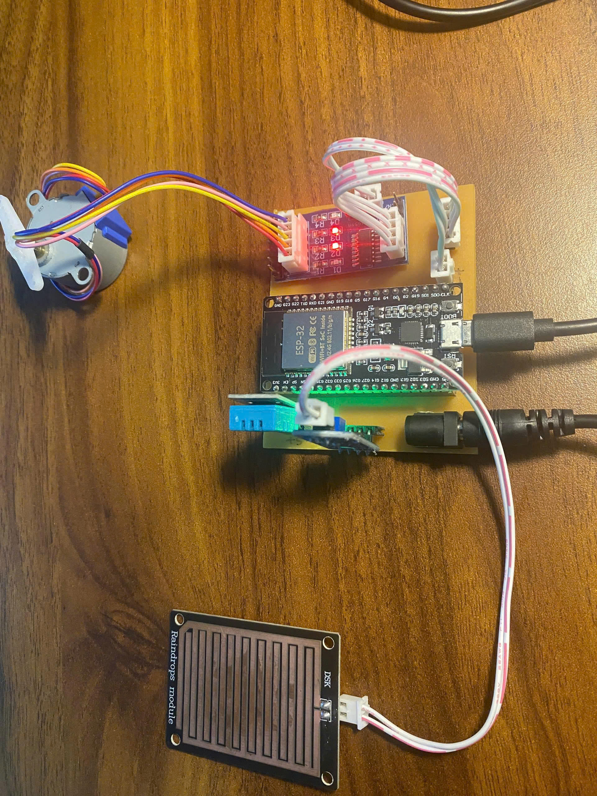
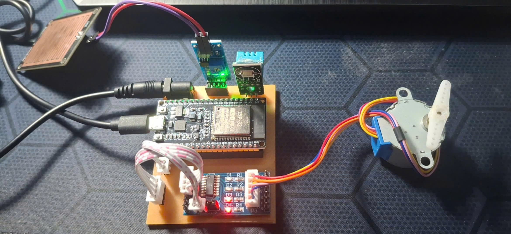
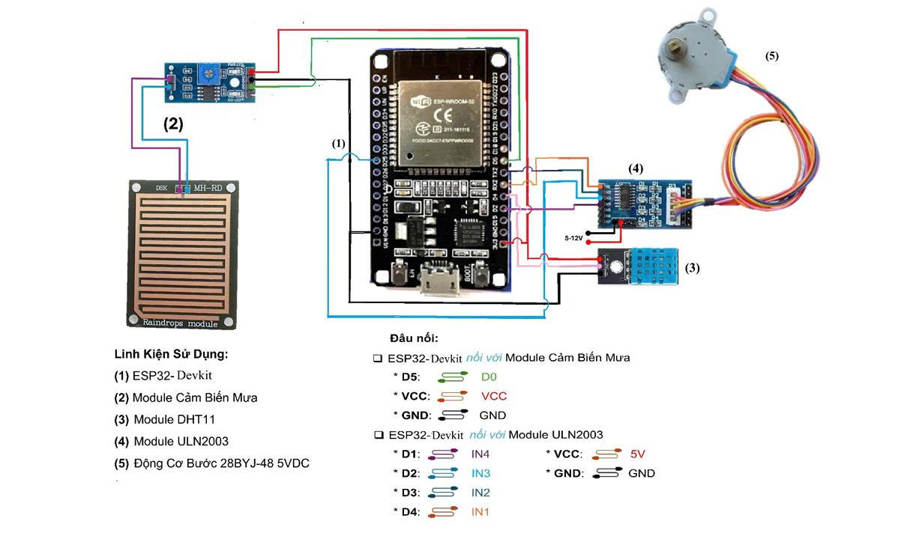
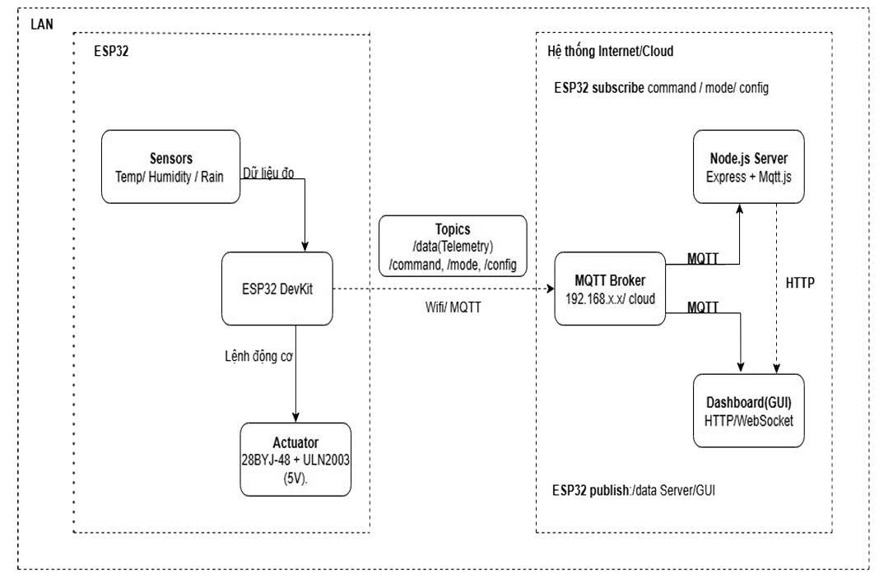

# 🧺 Automatic Clothes Drying Rack

> IoT-based embedded system that automatically controls a clothes drying rack based on real-time weather sensing, with a web dashboard for remote monitoring and control.

---

## 📖 Overview

The system uses an **ESP32** to continuously monitor **temperature**, **humidity**, and **rainfall**. When rain is detected, a **stepper motor** automatically retracts the rack — and extends it again when the weather clears. All data is published via **MQTT over WiFi** to a **Node.js backend** and accessible through a real-time **web dashboard**.

**Key Features:**
- 🌧️ Auto rain detection — rack retracts/extends instantly
- 🌡️ Temperature & humidity monitoring (DHT11)
- ⚙️ Stepper motor control (28BYJ-48 + ULN2003)
- 📡 MQTT over WiFi for real-time telemetry
- 🖥️ Web dashboard with Auto/Manual modes & scheduler
- 📊 Rain history charts and event timeline logging

---

## 🧰 Hardware Components

| # | Component | Role |
|---|-----------|------|
| 1 | ESP32 DevKit | Main microcontroller (WiFi + logic) |
| 2 | Rain Sensor Module (MH-RD) | Detects rainfall |
| 3 | DHT11 Module | Measures temperature & humidity |
| 4 | ULN2003 Driver Module | Stepper motor driver |
| 5 | 28BYJ-48 Stepper Motor (5VDC) | Opens/closes the rack |

---

## 📷 Hardware Model

<p align="center">
  
  &nbsp;&nbsp;
  
</p>

The prototype features an **ESP32 DevKit** on a custom PCB carrier, connected to the **ULN2003 driver** and **28BYJ-48 stepper motor** via a 4-wire cable. The **DHT11** monitors ambient conditions and the **MH-RD rain sensor pad** is placed externally. Powered via DC barrel jack + USB.

---

## 📐 System Diagrams

### Wiring Diagram

<p align="center">
  
</p>

| Module | ESP32 Pin | Module Pin |
|--------|-----------|------------|
| Rain Sensor | D5 | D0 (digital output) |
| Rain Sensor | VCC / GND | VCC / GND |
| ULN2003 | D1 / D2 / D3 / D4 | IN4 / IN3 / IN2 / IN1 |
| ULN2003 | 5V / GND | VCC / GND |
| DHT11 | dedicated data pin | DATA |

### System Architecture

<p align="center">
  
</p>


- **ESP32 publishes** sensor telemetry to `/data` topic every few seconds
- **ESP32 subscribes** to `/command`, `/mode`, `/config` for remote control
- **Node.js server** bridges MQTT ↔ Web Dashboard via HTTP + WebSocket

---

## 🖥️ Web Dashboard

<p align="center">
  
</p>

**Main Dashboard** — displays live sensor readings (temperature, humidity, weather, rack status), toggle Auto/Manual mode, configure rope length, and manage scheduled open/close events.

---

<p align="center">
  
</p>

**Rain History** — temperature & humidity trend charts + binary rain log (every 15 min), with a chronological event timeline (rain start/stop, connection events, rack movements).

---

## 🔧 Software Stack

| Layer | Technology |
|-------|-----------|
| Firmware | C++ (Arduino / PlatformIO) |
| IoT Protocol | MQTT (Mosquitto broker) |
| Backend | Node.js, Express.js, Mqtt.js |
| Frontend | HTML / CSS / JavaScript, WebSocket |

---

## 🚀 Getting Started

### 1. Flash ESP32 Firmware

Configure WiFi credentials and MQTT broker address in `ESP32_Client/config.h`, then flash via Arduino IDE or PlatformIO.

### 2. Setup MQTT Broker (Mosquitto)

Refer to [`Docs/Mosquitto_and_Server.docx`](Docs/Mosquitto_and_Server.docx) for detailed installation and configuration steps.

```bash
mosquitto -c mosquitto.conf
```

### 3. Start Node.js Server

```bash
cd Server
npm install
npm start
```

### 4. Open Dashboard

Navigate to `http://<server-ip>:3000` in your browser.

---

## 📁 Project Structure

```
├── Docs/
│   ├── Images/                    # Hardware photos and diagrams
│   └── Mosquitto_and_Server.docx
├── ESP32_Client/                  # ESP32 firmware (Arduino/PlatformIO)
├── Server/                        # Node.js backend (Express + MQTT)
├── Web_Client/                    # Web dashboard (HTML/CSS/JS)
└── README.md


